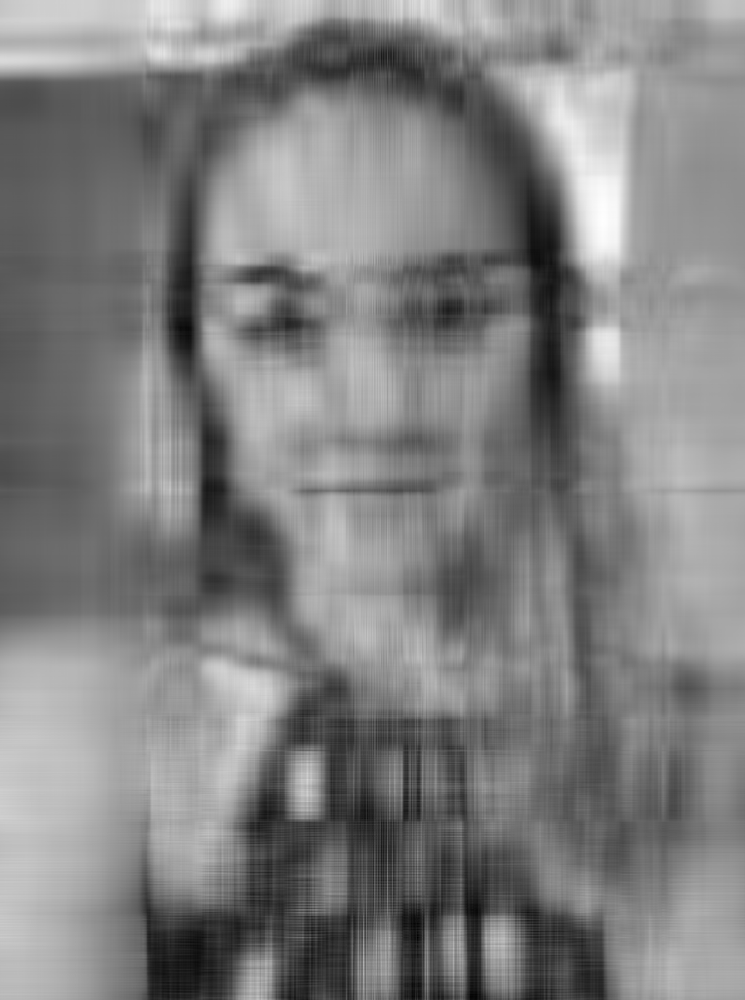

**TL;DR** I use Single Value Decomposition (SVD) to approximate photos of my own face and check if Apple's Photos app can still recognize my face at low rank levels. I find that the Photo app can recognize my face at rank 25, a 98% decrease in storage size from the original image. I hypothesize that SVD works particularly well on faces because of facial symmetry.

*Code for this project can be found on Github [right here.](https://github.com/averyr2/python_averyblog/blob/main/SVD%20Avery's%20Face.ipynb)

_____________________________________________________

For this project, I investigate how much I can reduce the storage space needed to store a black-and-white photo of my face still have Apple's facial recognition system recognize me! I will be using Single Value Decomposition to reduce a photo to a lower-rank matrix of grey pixel values that can be stored in a fraction of the space as the original photo.

In order to process this image using Single Value Decomposition (SVD), I need to make it black and white by setting each pixel value to the average over its RGB values. This is because SVD's computations are achievable over a 2x2 matrix, but solving SVD on a tensor (3 dimensional matrix) is NP-hard.

Now that the image has been pre-processed, I will run SVD on my (width x height) matrix of single pixel values. SVD is a strategy for apprimxating a matrix using a lower rank in a few steps: 

1. If a matrix has 500 rows and 400 columns, we can use SVD to decompose that matrix into a matrix multiplication between three matrices: `u` of dimensions (500 x 500), `s` of dimensions (width x height), and `vh` of dimensions (height X height).
2. Say we want to approximate our original matrix using a matrix of rank 10. We will then multiply the first 10 columns of `u` with the 10th diagonal of `s` and the first 10 rows of `vh`. 

This reduces our storage space very significantly - from $500 \times 400 = 200,000$ values for the original (500 x 400) matrix to one of $(500 \times 10) + (400 \times 1) + (400 \times 10) = 9,400$ values, a 95% decrease in size.

I will run SVD with rank sizes 10, 25, 50, 100, 200, 500, and 1000 to see approximately what rank image is still facially recognizable to Apple's Photo app. 

Low-rank matrices look surprisingly similar to my full-rank face image, and Apple's Photo app bears this out: it is able to recognize my face at rank 25, going from $1376 \times 1026 = 1,411,776$ values to only $(1376 \times 10) + (1026 \times 1) + (1026 \times 10) = 25046$ values, a whopping 98.3% decrease in storage space. 

I hypothesize that SVD works so well at low rank on faces because faces are very symmetric compared to other image types. Because SVD seeks to build the optimal linear combination of vectors to approximate the original image, a highly symmetrical image will be easier to approximate with less possible vector types! 

